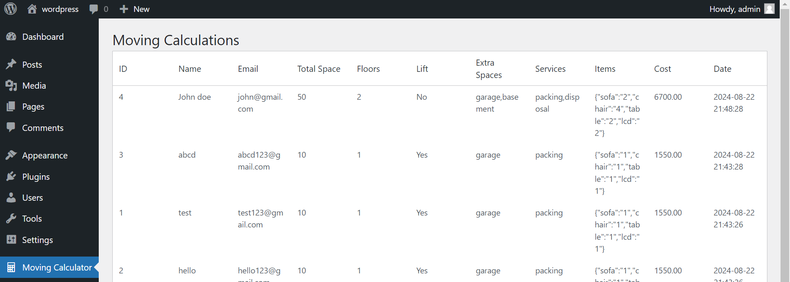
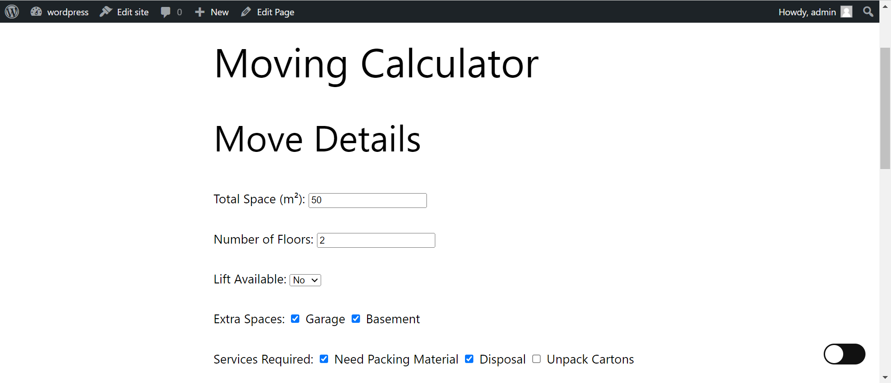
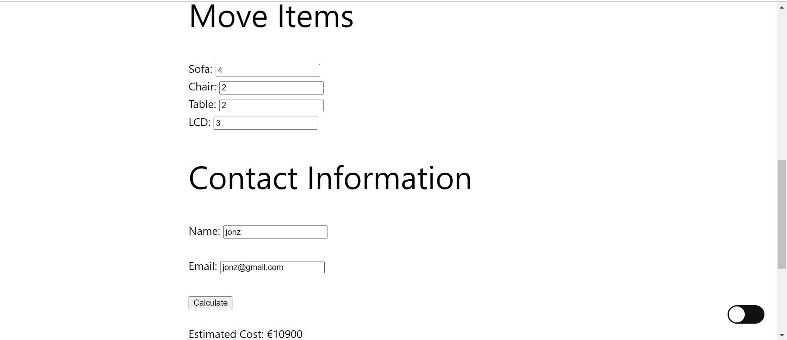

# Moving Cost Calculator WordPress Plugin

## Overview

The Moving Cost Calculator WordPress Plugin provides a simple interface for calculating moving costs based on user inputs. Users can enter details about their move, such as the total space, number of floors, availability of a lift, extra spaces, required services, and items to be moved. The plugin calculates the estimated cost and stores the data in a custom database table.


## Features

- **Cost Calculation**: Calculates moving costs based on space, floors, lift availability, extra spaces, services, and items.
- **Data Storage**: Stores user inputs and calculated costs in a custom database table.
- **Admin Dashboard**: Provides an admin page to view stored calculations.
- **Shortcode Support**: Allows you to easily insert the calculator form into any post or page.





## Installation

1. **Upload the Plugin**:
   - Download the plugin ZIP file.
   - Go to your WordPress admin dashboard.
   - Navigate to `Plugins` > `Add New` > `Upload Plugin`.
   - Choose the ZIP file and click `Install Now`.

2. **Activate the Plugin**:
   - After installation, activate the plugin by going to `Plugins` > `Installed Plugins` and clicking `Activate` next to the "Moving Cost Calculator" plugin.

## Usage

To display the moving cost calculator form on any post or page, use the following shortcode:

```plaintext
[moving_calculator]
